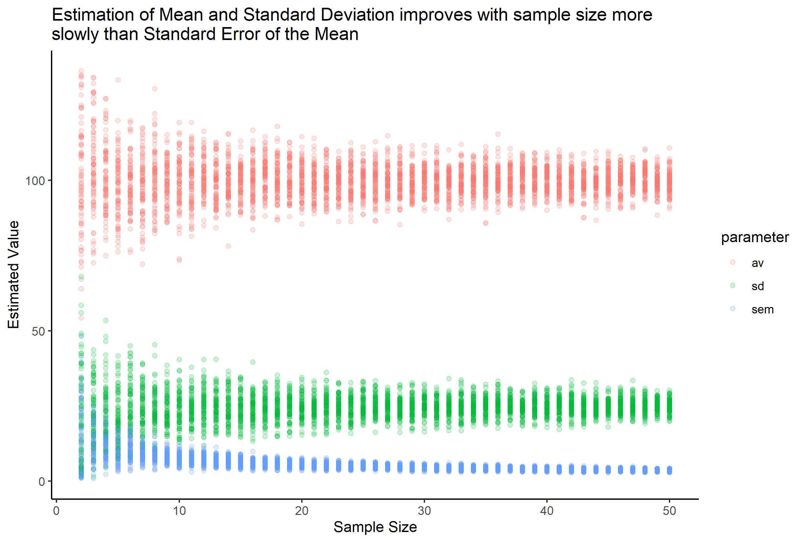

### Premise
I wrote this small report after completing a challenge issued by one of my professors and mentors, Dr. TJ Murphy (https://github.com/TJMurphy). The challenge, briefly, is to generate a plot illustrating the change in estimated mean, standard deviation (SD), and standard error of the mean (SEM) over several sample sizes. After first failing to solve this problem on my own, I came back to it later when he re-issued it to folks in the department of pharmacology. It serves as a straightforward exercise in R programming as well as an example of how differently SD and SEM behave. Moreover, it shows how ineffective using the “n = 3” approach, an unfortunate staple of biological research, truly is.

### Introduction
Standard deviation (SD) and standard error of the mean (SEM) are two statistical measures that are used to describe variation in data but for two different qualities of the data. The SD measures the dispersion of points around an estimated mean [@Dawson2004] while the SEM measures the dispersion of multiple sampled means around the estimated mean of the true population [@Barde2012]. In other words, SEM measures how accurately the mean was estimated. They are related but distinct metrics. Importantly, they are meant to be used differently. SD is meant to be used as a descriptive statistic concerning the raw data while SEM can be used to determine confidence intervals within which the true mean of the population is likely to be [@Barde2012].

The SEM can be derived from the SD. Consider a sample S made of up several observations of continuous data. The estimated standard deviation of the population based on S is:

SD = $\sqrt{\frac{1}{N-1}\sum_{i=1}^n (x_i - \bar{x})^2}$

The SEM for the same sample S is:

SEM = $\frac{SD}{\sqrt{N}}$

The SD and SEM are related by the inverse of the square root of the number of observations N. While both the accuracy of the SD will increase and SEM will approach zero as N increases, SEM will approach zero much more quickly than the SD will approach its true value. This is apparent in **figure** 1 below.

**Fig 1: Random parameter estimates over different sample sizes from 2-50**

True mean = 100, true SD = 25

### Problem

Despite independent definitions and prescribed applications, these two measures are often put at odds due to misuse. Frequently, researchers will present charts using mean ± SEM when 1) the data would be more aptly charted using mean ± SD and 2) when it would be more appropriate to describe the data in terms of its standard deviation [@Jaykaran2010;@Barde2012]. This misuse has been identified in several fields of biological research including cardiovascular biology [@Wullschleger2014], anesthesia [@Avram1985;@Nagele2003], tropical medicine and hygiene [@Cruess1989], arthritis and rheumatism [@Felson1984], infectious disease [@MacArthur1984], and psychiatry [@White1979].

This is likely due to the fact that errorbars drawn from SEM are much smaller than those of SD. This is evident in **figure 1** which demonstrates how quickly the value of SEM decreases compared to SD. Rigorous and reproducible science requires that statistical methods are correctly and appropriately applied. Moreover, Jaykaran has proposed a change in the syntax of reporting mean and SD vs. mean and SEM to mean (SD) and mean $\pm$SEM to further prevent confusion [@Jaykaran2010]. 

### Challenge

As mentioned in the premise, I was inspired to write this brief report after being challenged by my mentor Dr. TJ Murphy to generate **figure 1** above. Now, I challenge you, the reader, to generate this same plot. 

These data are random samples drawn from a normal distribution that has a mean of 100 and sd of 25. For each sample size, calculate the mean, SD and SEM. For all sample sizes, there are 75 replicates. The sample sizes vary from 2 to 50.

I have solved this problem using a tidyr/dplyr heavy method in Mean_SD_SEM_solved.R. There are, however, many different ways to accomplish this. I look forward to hearing about the different methods everyone employs!

### Citations

